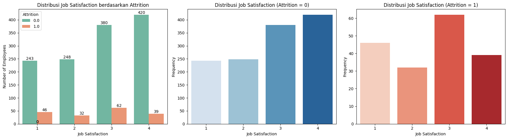
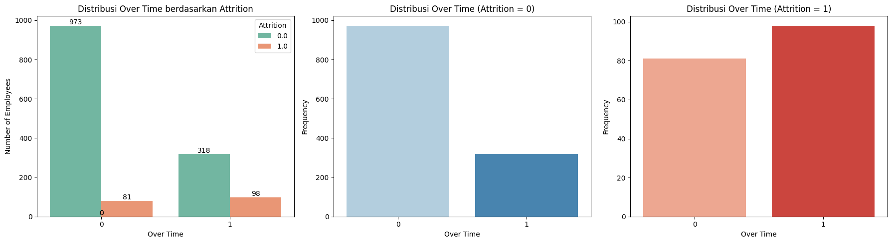

# Proyek Akhir: Menyelesaikan Permasalahan Perusahaan Edutech

## Business Understanding

Jaya Jaya Maju, sebuah perusahaan multinasional yang telah beroperasi sejak tahun 2000, menghadapi tantangan signifikan dalam mengelola sumber daya manusia. Meskipun memiliki lebih dari 1000 karyawan yang tersebar di seluruh negeri, perusahaan ini mencatatkan attrition rate (rasio karyawan yang keluar) lebih dari 10%, yang terbilang tinggi untuk perusahaan besar. Tingginya angka ini tidak hanya mencerminkan potensi masalah internal terkait kepuasan kerja dan kesejahteraan karyawan, tetapi juga dapat mengganggu stabilitas operasional perusahaan, terutama dalam mempertahankan tenaga kerja berpengalaman dan berkualitas. Untuk mengatasi masalah ini, departemen HR Jaya Jaya Maju berinisiatif mengidentifikasi faktor-faktor utama yang memengaruhi attrition rate di perusahaan. Dengan tujuan menciptakan strategi manajemen karyawan yang lebih efektif, mereka juga membutuhkan solusi teknologi berupa business dashboard untuk memonitor data

### Permasalahan Bisnis

Tujuan utama dari proyek data science ini adalah untuk mengidentifikasi faktor-faktor yang memengaruhi keputusan attrition pegawai di perusahaan Jaya Jaya Maju. Proyek ini juga bertujuan untuk menyediakan alat monitoring berbasis Dashboard yang dapat digunakan oleh departemen HR untuk menganalisis data lebih lanjut. Berikut adalah beberapa pertanyaan penting yang akan dijawab dalam proyek ini:

1. Apa faktor utama yang paling memengaruhi attrition pegawai?
2. Bagaimana peran faktor demografis seperti usia, status pernikahan, dan latar belakang pendidikan dalam keputusan attrition?
3. Faktor pekerjaan apa yang paling signifikan, seperti tingkat kepuasan kerja, work-life balance, atau peluang promosi, terhadap keputusan attrition?
4. Bagaimana tingkat pendapatan bulanan maupun harian berhubungan dengan attrition pegawai?
5. Apakah pegawai di departemen tertentu memiliki tingkat attrition lebih tinggi dibandingkan departemen lain?
6. Dapatkah model prediksi membantu mengidentifikasi pegawai yang memiliki risiko tinggi untuk keluar?

### Cakupan Proyek

Proyek ini mencakup tiga tahap utama untuk mencapai tujuan bisnis yang ditentukan

1. Melakukan Exploratory Data Analysis

Mengidentifikasi pola umum data dengan memahami distribusi dan hubungan antar atribut, terutama antara variabel independen dan variabel target (Attrition).

2. Membuat Model Klasifikasi

Melatih model machine learning dan mengevaluasinya untuk melihat performa prediksi model, serta melakukan analisis feature importance untuk menidentifikasi faktor utama yang mempengaruhi attrition.

3. Pembuatan Dashboard untuk Memonitor Data

Mengembangkan dashboard dengan visualisasi terkait attrition pegawai sebagai alat bantu HR untuk memonitor data-data yang berhubungan dengan attrition pegawai.

### Persiapan

Sumber data: [Sumber Data Employee](https://github.com/dicodingacademy/dicoding_dataset/tree/main/employee)

Setup environment:
1. Mempersiapkan Google Colab
2. Import seluruh library yang dibutuhkan
```
import pandas as pd
import numpy as np
import matplotlib.pyplot as plt
import seaborn as sns

from sklearn.linear_model import LogisticRegression
from sklearn.ensemble import RandomForestClassifier
import xgboost as xgb
from sklearn.metrics import accuracy_score, precision_score, recall_score, confusion_matrix
from sklearn.model_selection import train_test_split
from sklearn.preprocessing import MinMaxScaler, LabelEncoder
```

### Data Understanding

Data yang akan diolah diambil merupakan dataset yang berisi informasi faktor-faktor yang dapat mempengaruhi keputusan "Attrition" seorang pegawai perusahaan untuk tetap bertahan di perusahaan atau keluar dari perusahaan. Dataset ini terdiri dari 1470 baris data dan 35 kolom. Data tersebut mengandung detail demografis, metriks pekerjaan, dan atribut attrition.

EmployeeId - Pengidentifikasi Pegawai
Attrition - Apakah pegawai keluar dari perusahaan? (0=no, 1=yes)
Age - Umur Pegawai
BusinessTravel - Komitmen bepergian untuk pekerjaan
DailyRate - Gaji harian
Department - departemen pegawai
DistanceFromHome - Jarak bekerja dari rumah (dalam km)
Education - 1-Belum Kuliah, 2-Kuliah, 3-Sarjana, 4-Master,5-Doctor
EducationField - Bidang pendidikan
EnvironmentSatisfaction - 1-Rendah, 2-Medium, 3-Tinggi, 4-Sangat Tinggi
Gender - Jenis kelamin pegawai
HourlyRate - Gaji per jam
JobInvolvement - 1-Rendah, 2-Medium, 3-Tinggi, 4-Sangat Tinggi
JobLevel - Tingkat pekerjaan (1 hingga 5)
JobRole - Jabatan pekerjaan
JobSatisfaction - 1-Rendah, 2-Medium, 3-Tinggi, 4-Sangat Tinggi
MaritalStatus - Status pernikahan
MonthlyIncome - Pendapatan bulanan
MonthlyRate - Gaji bulanan
NumCompaniesWorked - Jumlah perusahaan tempat bekerja
Over18 - Apakah lebih dari 18 tahun?
OverTime - Apakah over time?
PercentSalaryHike - Persentase kenaikan gaji tahun lalu
PerformanceRating - 1-Low, 2-Good, 3-Excellent, 4-Outstanding
RelationshipSatisfaction - 1-Rendah, 2-Medium, 3-Tinggi, 4-Sangat Tinggi
StandardHours - Standar waktu bekerja
StockOptionLevel - Stock Option Level
TotalWorkingYears - Total tahun bekerja
TrainingTimesLastYear - Jumlah pelatihan yang didatangi tahun lalu
WorkLifeBalance - 1-Low, 2-Good, 3-Excellent, 4-Outstanding
YearsAtCompany - Lama tahun di perusahaan
YearsInCurrentRole - Lama tahun di jabatan saat ini.
YearsSinceLastPromotion - Lama tahun sejak terakhir promosi
YearsWithCurrManager - Lama tahun bersama manajer saat ini

Pada dataset ini juga mengandung missing values atau nilai yang hilang, tepatnya pada kolom Attrition sebanyak 412 baris. Untuk menangani hal tersebut, kita akan asumsikan pegawai dengan attrition yang hilang merupakan pegawai yang tetap bertahan di perusahaan sehingga kita dapat mengisinya dengan nilai 0. Berikut merupakan kode untuk menangani missing values tersebut.

```
df['Attrition'] = df['Attrition'].fillna(df['Attrition'].mode()[0])
```

## Exploratory Data Analysis

Langkah berikutnya merupakan exploratory data analysis (EDA) yang merupakan salah satu cakupan proyek ini.

### Distribution Analysis


Berdasarkan visualisasi tersebut, kolom Attrition memiliki distribusi yang tidak seimbang di mana pegawai yang tidak pergi ada sebanyak 1291 dan yang pergi (Attrition = 1) sebanyak 179 pegawai.

Setelah itu mari kita lihat distribusi beberapa atribut lainnya dan hubungannya terhadap atribut Attrition, diantaranya:

1. Distance From Home


Histogram di atas menunjukan bahwa sebagian besar pegawai yang tinggal relatif dekat dengan tempat kerja (kurang dari 10 km) cenderung tetap bertahan di perusahaan. Sedangkan pegawai yang tinggal lebih jauh cenderung sedikit jumlah yang memilih untuk tetap bertahan. Histplot ini memberikan indikasi awal bahwa jarak rumah ke tempat kerja mungkin memiliki hubungan dengan tingkat attrition.

2. Business Travel


Hasil visualisasi menunjukkan adanya hubungan antara frekuensi bepergian untuk pekerjaan dengan keputusan attrition pegawai. Pegawai yang lebih sering bepergian memiliki persentase attrition "Yes" yang paling tinggi (18.4%), dibandingkan dengan mereka yang jarang bepergian (11.2%) atau tidak bepergian sama sekali (7%). Hal ini mengindikasikan bahwa tingkat mobilitas pekerjaan dapat menjadi salah satu faktor yang memengaruhi keputusan pegawai untuk keluar dari perusahaan.

3. Years With Curr Manager


Histplot tersebut menunjukan bahwa sebagian besar pegawai yang baru bekerja dengan manajer saat ini (kurang dari 2 tahun) cukup banyak keluar dari perusahaan. Namun, jumlah yang memilih untuk bertahan juga cukup banyak. Sedangkan pegawai yang telah lama bekerja dengan manajer saat ini, semakin sedikit jumlahnya yang keluar.

### Hubungan Atribut Demografis dengan Attrition Pegawai

1. Gender


Presentasi pegawai laki-laki yang keluar dari perusahaan sebesar 12.2% dari seluruh pegawai laki-laki yang ada. Sedangkan presentase pegawai perepmpuan yang keluar dari perusahaan ada di angka 12% dari seluruh pegawai perempuan dalam perusahaan tersebut. Dikarenakan angka yang tidak jauh berbeda, kita bisa menyimpulkan bahwa jenis kelamin tidak memiliki pengaruh yang signifikan terhadap attrition pegawai

2. Age


Tampaknya tidak ada perbedaan yang signifikan dalam distribusi usia antara pegawai yang tetap bertahan dan yang keluar. Kedua kelompok memiliki distribusi usia yang cukup mirip, dengan median usia yang tidak jauh berbeda. Akan tetapi, data menunjukan bahwa pegawai yang memilih untuk keluar mayoritas cenderung memiliki usia yang lebih muda dibandingkan pegawai yang memilih bertahan. Ini menunjukkan bahwa usia bisa menjadi salah satu faktor dominan yang mempengaruhi keputusan pegawai untuk keluar dari perusahaan dalam dataset ini.

3. Marital Status


Grafik tersebut menunjukan sebagian besar pegawai yang menikah (611 orang) cenderung tetap bertahan di perusahaan. Angka ini jauh lebih tinggi dibandingkan dengan jumlah pegawai menikah yang keluar. Akan tetapi, persentase pegawai yang masih single dan memilih untuk keluar lebih besar dibandingkan yang sudah menikah. Hal tersebut mengindikasikan bahwa status pernikahan, terutama untuk pegawai yang masih single, bisa menjadi salah satu faktor dalam pengambilan keputusan pegawai.

4. Latar Belakang Pendidikan


Dari visualisasi, terlihat bahwa jumlah pegawai dengan attrition "Yes" tertinggi berasal dari bidang pendidikan Life Science, dengan total 70 orang. Namun, perlu dicatat bahwa bidang Life Science juga memiliki jumlah pegawai keseluruhan yang paling banyak dibandingkan bidang lainnya. Hal ini menyebabkan persentase attrition "Yes" dalam setiap bidang pendidikan cenderung serupa. Oleh karena itu, data ini menunjukkan bahwa latar belakang pendidikan kemungkinan besar bukan faktor yang signifikan dalam memengaruhi keputusan attrition.

### Hubungan Atribut Pekerjaan dengan Attrition Pegawai

1. Tingkat Kepuasan Kerja



Diagram batang di atas menunjukkan bahwa distribusi pegawai yang tetap bertahan di perusahaan cenderung meningkat seiring dengan tingginya tingkat kepuasan kerja. Sebaliknya, untuk pegawai yang memilih keluar (attrition "Yes"), distribusi tidak menunjukkan perbedaan yang signifikan di antara berbagai tingkat kepuasan kerja. Hal ini mengindikasikan bahwa persentase pegawai dengan tingkat kepuasan kerja rendah yang meninggalkan perusahaan cenderung lebih tinggi dibandingkan dengan mereka yang memiliki tingkat kepuasan kerja tinggi.

Kesimpulannya, tingkat kepuasan kerja tampaknya menjadi faktor penting yang memengaruhi keputusan pegawai untuk tetap bertahan. Pegawai yang merasa kurang puas dengan pekerjaannya lebih rentan untuk keluar dari perusahaan.

2. Work Life Balance


Kesimpulan dari visualisasi ini menunjukkan bahwa pegawai dengan tingkat work-life balance rendah (kategori 1) memiliki persentase attrition tertinggi, yaitu sebesar 22.5%. Sebaliknya, pegawai dengan work-life balance kategori 3 dan 4 memiliki tingkat attrition yang lebih rendah, masing-masing sebesar 10.52% dan 14.7%. Hal ini mengindikasikan bahwa keseimbangan antara pekerjaan dan kehidupan pribadi memainkan peran penting dalam keputusan pegawai untuk tetap bekerja di perusahaan.

3. Performance Rating


Visualisasi tersebut menunjukan adanya presentase pegawai Attrition yang lebih tinggi pada Performace Rating 4 sebesar 12.4% diabndingkan pegawau dengan Performance Rating 4 sebesar 12.1%. Meski selisihnya kecil, ada indikasi bahwa pegawai dengan Performance Rating lebih tingga (3) mungkin lebih cenderung keluar dibandingkan mereka dengan Performance Rating lebih rendah (3). Namun, tidak adanya perbedaan yang mencolok dalam persentase Attrition antara Performance Rating 3 dan 4  mengindikasikan bahwa Performance Rating mungkin bukan satu-satunya faktor utama yang memengaruhi keputusan pegawai untuk keluar.

### Hubungan Pendapatan Bulanan / Harian pada Attrition

1. Daily Rate


Hasil analisis dari kode di atas menunjukkan bahwa mayoritas pegawai dengan attrition "Yes" memiliki gaji harian yang terkonsentrasi pada rentang 400-600, dengan jumlah yang cukup signifikan pada rentang 100-400. Hal ini mengindikasikan bahwa sebagian besar pegawai yang keluar cenderung berada di kelompok dengan gaji harian yang lebih rendah.

Sebaliknya, distribusi gaji harian untuk pegawai dengan attrition "No" relatif lebih merata di seluruh rentang, dengan puncak pada rentang 600 hingga 1200. Temuan ini menunjukkan bahwa pegawai yang tetap bertahan cenderung memiliki daily rate yang sedikit lebih tinggi dibandingkan dengan mereka yang keluar. Namun, meskipun terdapat perbedaan dalam distribusi gaji harian, hasil ini juga mengindikasikan bahwa gaji bukanlah satu-satunya faktor utama yang memengaruhi keputusan attrition.

2. Monthly Income


Bar chart ini memberikan indikasi awal bahwa pendapatan bulanan memiliki hubungan dengan tingkat attrition. Pegawai dengan pendapatan yang lebih rendah cenderung lebih mudah keluar dari perusahaan. Namun, perlu diingat bahwa pendapatan bulanan hanyalah salah satu faktor yang mempengaruhi keputusan pegawai untuk keluar.

3. Monthly Rate


Berdasarkan grafik di atas, dapat disimpulkan bahwa terdapat hubungan antara pendapatan bulanan dengan tingkat attrition pegawai. Pegawai dengan pendapatan yang lebih rendah cenderung lebih mudah keluar dari perusahaan.

### Hubungan Attrition dengan Department


Hasil visualisasi menunjukkan bahwa tingkat attrition bervariasi antar departemen dalam perusahaan. Departemen Sales memiliki tingkat attrition tertinggi dengan persentase 14.7%, diikuti oleh departemen Research & Development sebesar 11.1%, dan departemen Human Resources dengan persentase terendah yaitu 9.5%. Hal ini mengindikasikan bahwa pegawai di departemen Sales cenderung lebih rentan untuk keluar dibandingkan departemen lainnya.

## Data Preparation

Tahap data preparation dilakukan dengan melalukan preprocessing yang terdiri dari pembersihan data, encoding data kategorik, normalisasi, dan pembagian data.

1. Pembersihan Data

Proses pembersihan data dimulai dengan memeriksa baris yang terduplikasi dengan kode berikut ini.

```
duplicate_rows = df[df.duplicated()]
print("Number of duplicate rows:", len(duplicate_rows))
print(duplicate_rows)
```

Kode tersebut menunjukan tidak adanya baris duplikat sehingga kita dapat lanjut ke tahap encoding.

2. Encoding

Setelah proses pembersihan data dilakukan maka proses berlanjut ke tahap encoding, yaitu melakukan konversi data dengan tipe kategorikal ke numerik. Hal ini kita lakukan dengan menggunakan label encoder.

```
le = LabelEncoder()

categorical_cols = df.select_dtypes(include=['object']).columns

for col in categorical_cols:
    df[col] = le.fit_transform(df[col])
```

3. Normalisasi

Langkah selanjutnya adalah memisahkan atribut dengan target ke dalam variabel X dan y, lalu melakukan normalisasi ke atribut (X) untuk memastikan semua fitur berada pada skala yang sama dan mengurangi potensi dominasi fitur dengan rentang nilai yang lebih besar terhadap model.
```
X = df.drop(columns=['Attrition', 'EmployeeId'], axis=1)
y = df['Attrition']
```

Perhitungan normalisasi dilakukan dengan MinMaxScaler, yang mengubah setiap nilai dalam fitur ke dalam rentang [0, 1].
```
scaler = MinMaxScaler()
X_scaled = scaler.fit_transform(X)
```

Tujuan utama dari normalisasi adalah untuk meningkatkan kinerja model dengan cara memastikan bahwa setiap fitur berkontribusi secara proporsional.

4. Pembagian Data

Langkah selanjutnya adalah pembagian data untuk training dan testing menggunakan fungsi train_test_split.

```
X_train, X_test, y_train, y_test = train_test_split(X_scaled, y, test_size=0.2, random_state=42)
```

## Modeling

Tahap modeling mencakup pelatihan model klasifikasi attrition dengan beberapa algoritma machine learning, diantaranya adalah logistic regression, random forest, dan xgboost.

1. Logistic Regression
- Cara Kerja

Logistic Regression adalah algoritma pembelajaran mesin yang digunakan untuk klasifikasi biner. Algoritma ini memodelkan probabilitas kelas target sebagai fungsi logistik (sigmoid) dari kombinasi linear dari fitur input. Logistic regression menghitung peluang suatu data termasuk dalam kelas tertentu berdasarkan hubungan linier antara fitur input dan log-odds (logaritma peluang). Hasilnya diubah menjadi probabilitas dengan fungsi sigmoid, dan kelas diprediksi berdasarkan ambang batas probabilitas yang ditentukan.

- Kelebihan

Sederhana, cepat, dan mudah diinterpretasikan karena memberikan koefisien untuk setiap fitur, yang menggambarkan pengaruhnya terhadap probabilitas output. Cocok untuk data linear dan bekerja baik pada dataset kecil.

- Kekurangan

Tidak cocok untuk hubungan non-linear karena asumsi dasarnya mengandalkan hubungan linier antara fitur dan output. Rentan terhadap multikolinearitas dan outlier, serta memerlukan preprocessing fitur dengan skala yang sama.

2. Random Forest
- Cara Kerja

Random Forest adalah ensemble learning method yang menggabungkan beberapa pohon keputusan untuk membuat prediksi. Algoritma ini bekerja dengan membangun banyak pohon keputusan secara acak dari subset data yang berbeda (bagging) dan menggunakan rata-rata atau voting mayoritas hasil prediksi dari setiap pohon untuk meningkatkan akurasi. Setiap pohon dibangun dengan memilih subset fitur dan sampel data secara acak, yang membantu mengurangi risiko overfitting.

- Kelebihan

Mampu menangani data non-linear dengan baik, tahan terhadap overfitting karena menggunakan bagging, dan memberikan fitur penting yang membantu interpretasi. Cocok untuk dataset besar dan kompleks dengan kombinasi fitur numerik dan kategorikal.

- Kekurangan

Memerlukan lebih banyak sumber daya komputasi dibandingkan dengan model linear. Prediksi bisa lambat untuk dataset sangat besar karena melibatkan penggabungan hasil dari banyak pohon. Sulit diinterpretasikan karena sifatnya sebagai model ensemble.

3. XgBoost
- Cara Kerja

XGBoost (Extreme Gradient Boosting) adalah algoritma boosting berbasis pohon yang menggunakan teknik ensemble untuk meningkatkan kinerja prediksi. XGBoost membangun pohon keputusan secara iteratif, di mana setiap pohon berikutnya memperbaiki kesalahan yang dibuat oleh pohon sebelumnya. Algoritma ini mengoptimalkan fungsi loss secara efisien menggunakan teknik regulasi untuk mencegah overfitting, menjadikannya salah satu metode yang sangat kuat dalam menangani dataset dengan banyak fitur.

- Kelebihan

Sangat efisien dalam komputasi karena memanfaatkan paralelisme. Memiliki kinerja tinggi untuk data non-linear dan dapat disesuaikan dengan berbagai hiperparameter untuk menangani data yang kompleks. Mampu menangani outlier dan missing values dengan lebih baik.

- Kekurangan

Memiliki kompleksitas model dan memerlukan tuning hiperparameter yang ekstensif agar menghasilkan performa optimal. Membutuhkan sumber daya komputasi tinggi, terutama untuk dataset besar, sehingga lebih sulit digunakan tanpa pemahaman mendalam tentang algoritma.

## Evaluation

Model yang telah dilatih kemudian dievalusasi menggunakan akurasi, presisi, recall, confusion matrix, dan feature importances. Evaluasi model dialkukan dengan berbagai metrik untuk mendapatkan gambaran menyeluruh tentang kinerja model. Berikut adalah tujuan dari masing-masing metrik beserta penjelasan dan rumus matematikanya:

1. Akurasi

Akurasi mengukur persentase prediksi yang benar dari total prediksi yang dibuat oleh model. Tujuan utamanya adalah memberikan indikasi keseluruhan kinerja model, terutama jika kelas target seimbang.

Akurasi = (TP + TN) / (TP +TN + FP + FN)

2. Presisi

Presisi mengukur proporsi prediksi positif yang benar terhadap seluruh prediksi positif yang dibuat model. Metrik ini berguna ketika kesalahan prediksi positif (false positives) harus diminimalkan. Rumusnya adalah:

Presisi = TP / (TP + FP)

3. Recall

Recall mengukur kemampuan model dalam mengidentifikasi semua kasus positif yang benar. Metrik ini penting ketika kesalahan prediksi negatif (false negatives) memiliki konsekuensi besar. Rumusnya adalah:

Recall = TP / (TP + FN)

4. Confusion Matrix

Confusion matrix adalah tabel yang digunakan untuk memvisualisasikan performa model klasifikasi. Matriks ini mencakup nilai TP, TN, FP, dan FN, yang membantu mengevaluasi distribusi kesalahan prediksi. Dengan memahami matriks ini, kita dapat mengidentifikasi pola kesalahan spesifik dalam prediksi model dan menyesuaikan strategi perbaikan.

5. Feature Importances

Feature importances menunjukkan seberapa besar kontribusi setiap fitur dalam membuat prediksi. Tujuan dari analisis ini adalah untuk memahami variabel mana yang paling berpengaruh terhadap keputusan model, sehingga dapat digunakan untuk interpretasi dan pengambilan keputusan. Dalam model seperti Random Forest dan XGBoost, pentingnya fitur dihitung berdasarkan penurunan kinerja model (misalnya, peningkatan impuritas atau loss) ketika fitur tersebut diubah atau dihilangkan.

### Hasil Evalusasi Tiap Model

Berikut merupakan hasil evaluasi dari tiap model yang dilatih.

1. Logistic Regression

Logistic Regression Accuracy: 0.8979591836734694

Logistic Regression Precision: 0.6

Logistic Regression Recall: 0.1875

Logistic Regression Confusion Matrix:
[[258   4]
 [ 26   6]]

2. Random Forest

Random Forest Accuracy: 0.8843537414965986

Random Forest Precision: 0.3333333333333333

Random Forest Recall: 0.0625

Random Forest Confusion Matrix:
[[258   4]
 [ 30   2]]

3. XgBoost

XGBoost Accuracy: 0.8809523809523809

XGBoost Precision: 0.38461538461538464

XGBoost Recall: 0.15625

XGBoost Confusion Matrix:
[[254   8]
 [ 27   5]]

Berdasarkan hasil evaluasi model, Logistic Regression menunjukkan kinerja keseluruhan terbaik dengan akurasi tertinggi sebesar 89,80% dibandingkan Random Forest (88,44%) dan XGBoost (88,10%). Namun, dalam hal presisi dan recall, model ini tidak sepenuhnya optimal, dengan presisi 60% dan recall hanya 18,75%, mengindikasikan bahwa Logistic Regression cenderung lebih sering mengidentifikasi pegawai yang tidak akan keluar (Attrition = 0) dengan baik, tetapi memiliki keterbatasan dalam mendeteksi pegawai yang berisiko keluar (Attrition = 1). Random Forest memiliki presisi dan recall terendah (33,33% dan 6,25%), menunjukkan model ini lebih jarang mendeteksi pegawai yang keluar, meskipun tetap memiliki akurasi yang kompetitif. XGBoost, meski akurasinya sedikit lebih rendah, memberikan keseimbangan yang lebih baik antara presisi (38,46%) dan recall (15,62%), menjadikannya alternatif yang lebih andal dalam mendeteksi pegawai yang berisiko keluar. Confusion matrix dari ketiga model menunjukkan bahwa mayoritas prediksi benar berasal dari kelas Attrition = 0, mengindikasikan ketidakseimbangan kelas memengaruhi hasil prediksi secara keseluruhan.

Lalu kita lanjutkan proses evalusai dengan mencetak 3 fitur teratas dalam feature importances masing-masing model dengan hasil berikut:

```
Top 3 features for Logistic Regression:
                    feature  importance
20                 OverTime    1.550789
11           JobInvolvement    1.314788
31  YearsSinceLastPromotion    1.292155

Top 3 features for Random Forest:
          feature  importance
0             Age    0.073557
16  MonthlyIncome    0.070469
2       DailyRate    0.058292

Top 3 features for XGBoost:
             feature  importance
25  StockOptionLevel    0.085713
20          OverTime    0.082822
16     MonthlyIncome    0.046392
```

Berdasarkan analisis feature importances di atas, sejumlah faktor yang cukup berpengaruh pada keputusan pegawai untuk tetap bertahan atau keluar dari perusahaan diantaranya adalah
1. Over Time
2. Monthly Income
3. Job Involvement
4. Stock Option Level
5. Age
6. Years Since Last Promotion
7. Daily Rate

Beberapa atribut telah kita analisis pada tahapan Exploratory Data Analysis, yaitu Monthly Income, Age, dan Daily Rate. Mari kita ulas kembali ketiga atribut tersebut

## Analisis Lanjutan

### Ulas Kembali

1. Monthly Income


Visualisasi diagram batang pada EDA telah menunjukan adanya indikasi awal bahwa pendapatan bulanan memiliki hubungan dengan tingkat attrition. Pegawai dengan pendapatan yang lebih rendah cenderung lebih mudah keluar dari perusahaan. Hal ini dibuktikan dengan tingginya kepentingan atribut Monthly Income dalam model prediksi.

2. Age


Meskipun tidak ada perbedaan yang signifikan dalam distribusi usia antara pegawai yang tetap bertahan dan yang keluar, namun diagram violin menunjukan adanya sedikit perbedaan pada median kedua nilai tersebut, di mana median dari pegawai yang memilih untuk keluar cenderung memiliki usia yang lebih muda dibandingkan pegawai yang memilih bertahan. Ini menunjukkan bahwa usia bisa menjadi salah satu faktor dominan yang mempengaruhi keputusan pegawai yang dibuktikan melalui analisis features importance tersebut.

3. Daily Rate


Tahapan EDA menunjukkan bahwa pegawai yang tetap bertahan cenderung memiliki daily rate yang sedikit lebih tinggi dibandingkan dengan mereka yang keluar. Hal tersebut menunjukan bahwa daily rate mungkin menjadi salah satu faktor penting dalam pengambilan keputusan untuk bertahan atau keluar dari perusahaan. Terbukti melalui analaisis feature importances, di mana atribut ini menjadi salah satu faktor yang paling penting dalam model prediksi.

### Hubungan Attrition dengan Over Time



Dari grafik tersebut, terlihat bahwa persentase pegawai yang melakukan lembur dan kemudian keluar (Attrition = 1) lebih tinggi dibandingkan dengan proporsi pegawai yang tidak melakukan lembur dan keluar dengan perbedaan yang cukup signifikan. Hal tersebut juga dapat dilihat melalui perbedaan skewness dari diagram distribusi over time untuk masing-masing attrition di mana pegawai yang bertahan memiliki distribusi miring ke kanan sedangkan pegawai yang keluar memiliki distribusi miring ke kiri. Fakta tersebut menunjukan hubungan yang cukup penting antara Over Time dengan keputusan pegawai pada attrition.

### Hubungan Attrition dengan Job Involvement


Dari grafik terlihat bahwa persentase pegawai dengan tingkat keterlibatan pekerjaan yang rendah (nilai lebih kecil) dan keluar dari perusahaan (Attrition = 1) lebih tinggi dibandingkan dengan persentase pegawai dengan tingkat keterlibatan yang tinggi dan keluar. Sebaliknya, persentase pegawai dengan tingkat keterlibatan pekerjaan yang tinggi dan tetap bertahan (Attrition = 0) lebih besar. Fakta bahwa "job involvement" menjadi salah satu fitur penting dalam model prediksi attrition menguatkan hipotesis bahwa tingkat keterlibatan pegawai memiliki pengaruh signifikan terhadap keputusan mereka untuk tetap bertahan atau keluar dari perusahaan.

### Hubungan Attrition dengan Stock Option Level


Dari grafik terlihat bahwa persentase pegawai dengan tingkat opsi saham yang lebih tinggi dan tetap bertahan (Attrition = 0) lebih besar dibandingkan dengan persentase pegawai dengan tingkat opsi saham yang lebih rendah dan tetap bertahan. Hal tersebut mengindikasikan bahwa opsi saham dapat berfungsi sebagai insentif yang efektif untuk mempertahankan pegawai. Pegawai dengan opsi saham yang lebih tinggi mungkin merasa lebih terikat dengan perusahaan dan memiliki insentif yang lebih besar untuk tetap bertahan.

### Hubungan Attrition dengan Years Since Last Promotion


Dari grafik terlihat bahwa persentase pegawai yang sudah lama tidak naik jabatan dan kemudian keluar (Attrition = 1) lebih tinggi dibandingkan dengan persentase pegawai yang baru saja naik jabatan atau sering naik jabatan dan tetap bertahan (Attrition = 0). Hal tersebut mengindikasikan bahwa pegawai yang lebih sering mendapatkan promosi memiliki kemungkinan keluar dari perusahaan yang lebih kecil.

## Business Dashboard


Business dashboard dibuat menggunakan tools Google Looker Studio. Dashboard dapat diakses melalui link berikut ini

Link Dashboard: [HR Business Dashboard](https://lookerstudio.google.com/reporting/2cd17e60-d28c-42c1-a056-5c69031fd155)

Berikut merupakan tangkapan layar dari dashboard yang telah dibuat. Dashboard tersebut terbagi ke dalam 3 bagian, yaitu informasi overview terkait atribut attrition, informasi hubungan distribusi attrition berdasarkan atribut tertentu, dan informasi faktor yang paling berpengaruh pada attrition pegawai.

1. Overview Atribut Attrition


Bagian ini menjelaskan beberapa informasi umum terkait attrition pada dataset. Di mana kita bisa mengetahui jumlah pegawai yang attrition (keluar dari perusahaan) ada sebnayk 179 orang. Lalu tingkat attrition pegawai ada di angka 12.18% dari 1470 total pegawai yang ada.

Selain itu, ada juga diagram yang menunjukan distribusi attition di mana persentase pegawai yang keluar adalah sebesar 12.2% dan pegawai yang bertahan sebesar 87.8%.

2. Hubungan Distribusi Attrition berdasarkan Atribut Tertentu


Kemudian dashboard ini juga menampilkan analisis distribusi atribut Attrition berdasarkan beberapa atribut lainnya, yaitu Department, Age, dan Gender.

3. Faktor yang Paling Berpengaruh pada Attrition Pegawai


Bagian terakhir menunjukkan visualisasi hubungan antara beberapa atribut yang paling berpengaruh pada keputusan attrition pegawai, yaitu Over Time, Job Involvement, Years Since Last Promotion, dan Stock Option Level.

 

Diagram di atas menunjukkan bahwa ketika seorang pegawai memiliki jam lembur, maka kemungkinan dia keluar dari perusahaan lebih besar dibandingkan dengan karyawan yang tidak memiliki jam lembur.


Diagram di atas menunjukkan bahwa semakin rendah tingkat keterlibatan kerja pegawai, semakin tinggi pula kemungkinan pegawai tersebut memilih untuk keluar.


Diagram di atas menunjukkan bahwa pegawai yang lebih sering menerima promosi cenderung tidak meninggalkan perusahaan.


Diagram tersebut menunjukkan bahwa pegawai dengan opsi saham yang lebih tinggi mungkin merasa lebih terikat dengan perusahaan dan memiliki insentif lebih besar untuk bertahan.

## Conclusion

Proyek ini berfokus pada analisis faktor-faktor yang memengaruhi keputusan pegawai untuk keluar dari perusahaan (attrition) dan membangun model prediksi untuk mengidentifikasi pegawai dengan risiko tinggi attrition. Berdasarkan hasil analisis data dan pemodelan, berikut adalah kesimpulan terkait permasalahan yang diajukan:

1. Faktor utama yang paling memengaruhi attrition pegawai

Faktor-faktor utama yang memengaruhi attrition meliputi Over Time, Monthly Income, dan Job Involvement, sebagaimana ditunjukkan oleh feature importance. Pegawai yang bekerja lembur secara signifikan lebih rentan terhadap attrition, menunjukkan bahwa keseimbangan antara pekerjaan dan kehidupan pribadi merupakan faktor penting.

2. Peran faktor demografis seperti usia, status pernikahan, dan latar belakang pendidikan

Faktor usia terbukti berperan dalam attrition, dengan pegawai yang lebih muda cenderung memiliki kemungkinan lebih besar untuk keluar. Meskipun status pernikahan dan latar belakang pendidikan tidak termasuk dalam fitur paling penting, distribusi usia menunjukkan bahwa faktor demografis tertentu tetap relevan dalam analisis ini.

3. Faktor pekerjaan yang paling signifikan terhadap attrition

Tingkat keterlibatan kerja (Job Involvement), keseimbangan kerja-kehidupan (Over Time), dan peluang promosi (Years Since Last Promotion) merupakan faktor pekerjaan yang paling signifikan. Pegawai yang merasa kurang terlibat atau jarang dipromosikan cenderung lebih mungkin untuk keluar, sebagaimana didukung oleh visualisasi dan model prediksi.

4. Hubungan tingkat pendapatan bulanan maupun harian dengan attrition

Pegawai dengan pendapatan bulanan atau harian yang lebih rendah cenderung lebih mudah keluar dari perusahaan. Visualisasi menunjukkan bahwa tingkat pendapatan adalah salah satu indikator kuat, dengan distribusi yang lebih rendah pada pegawai yang keluar dibandingkan yang bertahan.

5. Tingkat attrition berdasarkan departemen

Analisis menunjukkan bahwa pegawai di departemen Sales memiliki tingkat persentase attrition tertinggi dibandingkan departemen lain. Hal ini menunjukkan bahwa kondisi pekerjaan di departemen tertentu, terutama Sales, mungkin kurang memuaskan dibandingkan dengan departemen lain.

6. Kemampuan model prediksi untuk mengidentifikasi risiko attrition

Model prediksi yang dibangun mampu mengidentifikasi pegawai dengan risiko tinggi attrition menggunakan fitur seperti Over Time, Monthly Income, dan Stock Option Level. Akurasi yang dicapai oleh ketiga model juga cukup baik yang berada di angka sekitar 89%.

### Rekomendasi Action Items

Berdasarkan kesimpulan evaluasi model dan analisis faktor-faktor yang memengaruhi attrition pegawai, berikut adalah beberapa rekomendasi action items yang dapat diambil oleh perusahaan untuk mengatasi masalah attrition:

- Mengevaluasi Kebijakan Lembur yang Adil

Pegawai yang sering melakukan lembur memiliki risiko lebih tinggi untuk keluar dari perusahaan. HR perlu meninjau kebijakan lembur dengan memperhatikan workload dan menyediakan insentif tambahan untuk meringankan beban pegawai yang harus lembur secara rutin.

- Meningkatkan Efektivitas Pembagian Keterlibatan Kerja

Tingkat keterlibatan pekerjaan (Job Involvement) yang rendah secara signifikan memengaruhi keputusan pegawai untuk keluar. Perusahaan dapat memberikan pelatihan, mendengarkan umpan balik, dan memberikan pengakuan atas kontribusi pegawai untuk meningkatkan keterlibatan.

- Mengoptimalkan Opsi Saham

Opsi saham (Stock Option Level) terbukti menjadi salah satu faktor signifikan dalam memotivasi pegawai untuk tetap bertahan. Perusahaan dapat mempertimbangkan untuk menawarkan lebih banyak opsi saham kepada pegawai kunci sebagai bentuk insentif jangka panjang.

- Menyediakan Peluang Promosi yang Lebih Baik

Pegawai yang jarang mendapatkan promosi memiliki kecenderungan lebih besar untuk keluar. Menyusun program pengembangan karier yang adil dan terstruktur, serta memberikan promosi berdasarkan pencapaian, dapat membantu mengurangi tingkat attrition.

- Menyesuaikan Tingkat Pendapatan Pegawai

Pegawai dengan pendapatan bulanan dan harian yang lebih rendah cenderung memiliki risiko lebih tinggi untuk keluar. Perusahaan dapat mengevaluasi struktur gaji dan memastikan kompensasi yang lebih kompetitif di pasar untuk mempertahankan pegawai berbakat.
